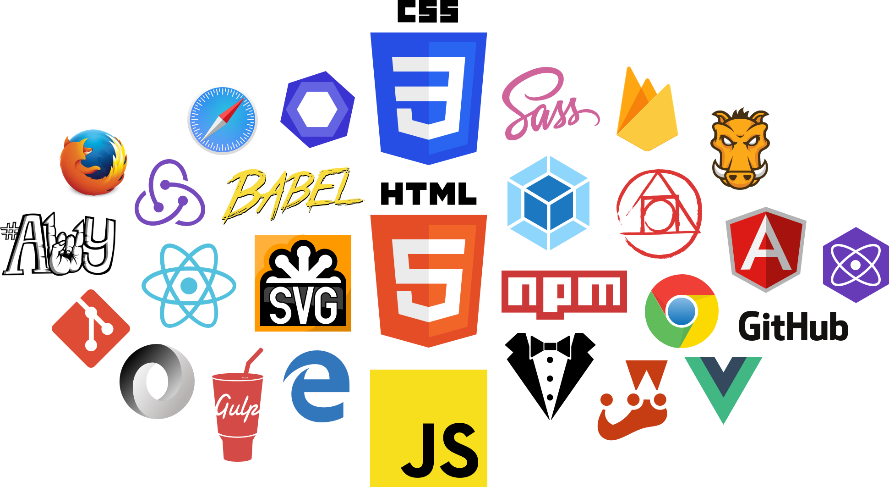

## 2022年前端笔试面试题

欢迎大家一起出题 和 解题 、 提交PR 😋😋

[题库](https://github.com/zanjs/awesome-frontend-interview/issues)

## 面前准备

### 快速浏览

1. [ECMAScript 6 入门](http://es6.ruanyifeng.com/)
2. [30秒就能理解的JavaScript优秀代码 30-seconds-of-code](https://github.com/kujian/30-seconds-of-code)
3. [30-seconds-of-css](https://atomiks.github.io/30-seconds-of-css/)

## 祝福

我们希望每一个爱好前端得朋友， 都能找到一份喜欢得工作，所以我们在此收集高质量得 **面试题** 来助力！🚀🚀🚀

  

## 计划

> 持续更新

## 觉得不错

伸出您得宝贵 `Star` 这个项目

## 参考收集来源

感谢一下作者

[WangXiZhu](https://github.com/WangXiZhu/frontend-interview-question)

[jirengu](https://github.com/jirengu/frontend-interview)

